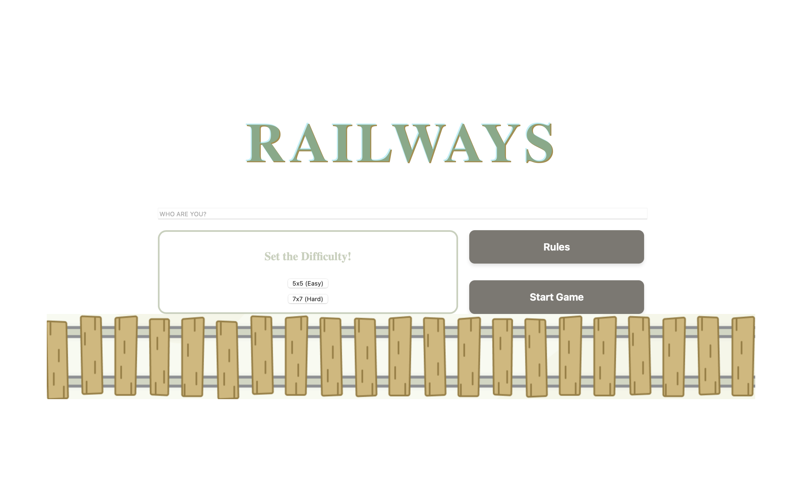
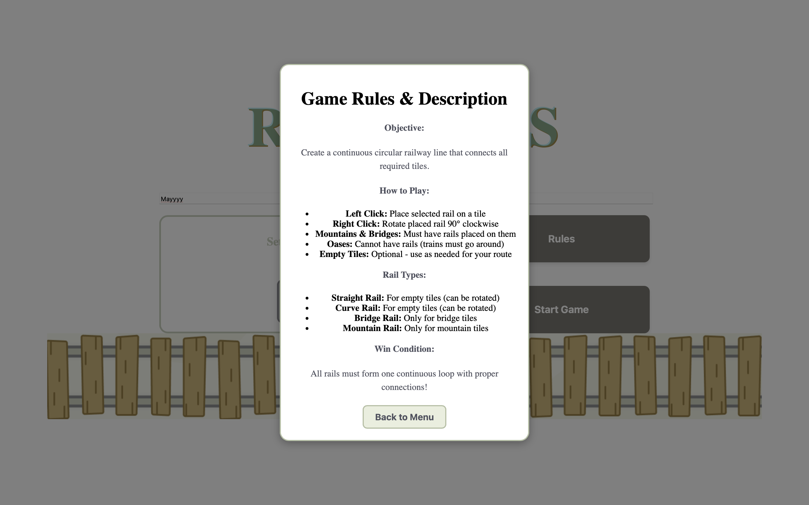

# 🚂 Railways – Route Designer Puzzle Game

A fun **logic puzzle game** where players design a circular railway track across different terrains.  
Your goal: **connect all mountains and bridges** while avoiding oases — and form one perfect loop!

---

## 🎮 Gameplay Overview

| Feature | Description |
|----------|-------------|
| 🧩 **Objective** | Create one continuous railway loop on the grid |
| 🎚️ **Difficulty** | Easy (5×5) • Hard (7×7) |
| 🗺️ **Levels** | 5 unique maps per difficulty |
| 🏔️ **Terrains** | Mountains, Bridges, Oases, and Empty tiles |
| 🚉 **Rail Types** | Straight, Curve, Bridge, and Mountain rails |

---

## 🕹️ How to Play

1. **Start Game** → Enter your name and choose difficulty  
2. **Place Rails** → Left-click to place, Right-click to rotate  
3. **Connect** → All rails must form one closed loop  
4. **Win** → Loop is valid if all rails connect and required terrains are used correctly  

---

## 📸 Screenshots

### 🗺️ Gameplay Interface
.png)

### 🗺️ Gameplay Interface
.png)

### ✅ Rules

---

## ⚙️ Tech Stack

| Component | Technology |
|------------|-------------|
| **Frontend** | HTML5, CSS3, Vanilla JavaScript |
| **Rendering** | Canvas-based grid system |
| **Logic** | Custom matrix data structure & rail validation algorithm |
| **Animations** | CSS transitions & smooth feedback effects |

---

## 🧠 Key Highlights

- Two grid sizes: **5×5** (Easy) and **7×7** (Hard)  
- Randomized maps for replayability  
- Real-time validation of connected rails  
- Fully animated rail placement and rotation  
- Minimalist and responsive UI design  

---

## 🚧 Future Improvements

- Hint and Undo/Redo system  
- Save/Load progress  
- Mobile touch support  
- Leaderboard with best completion times  

---

## 👩‍💻 Author

**Mary Uduakobong Okon**  
🎓 Computer Science Student | 💡 Passionate about Game Logic & Frontend Design  
📧 mary02okon@gmail.com  
🌍 [GitHub](https://github.com/Udua-arch) • [LinkedIn](https://www.linkedin.com/in/maryuduak/)  

---

> 💬 *“Connecting logic, creativity, and fun — one railway at a time.”*
